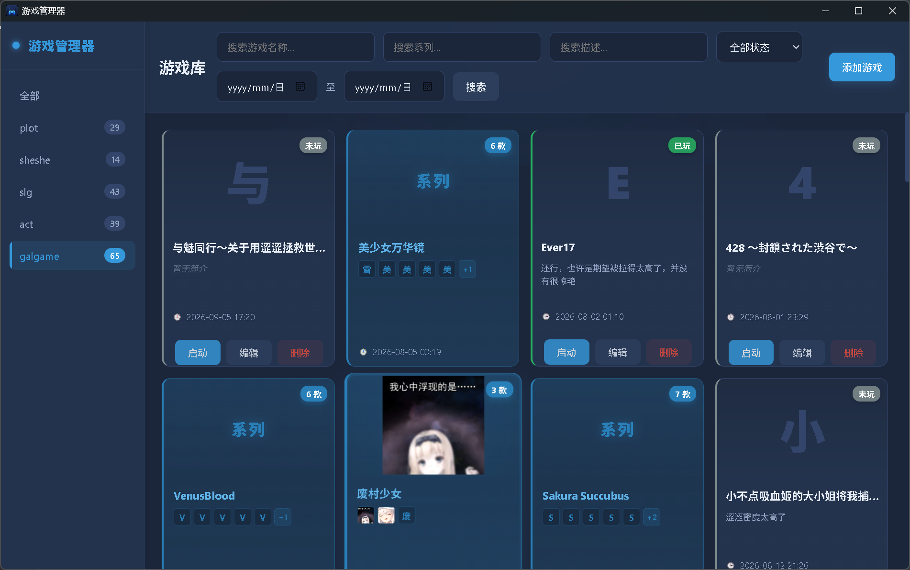

# 游戏管理器 (GameManager)

一个基于 **Wails v2 + Vue 3 + TypeScript + SQLite** 的桌面端游戏库管理工具。支持游戏分类、系列管理、截图展示等功能，界面采用深色主题。自用，会根据使用体验不断优化。

## 🖥️ 运行截图



## ✨ 功能特性

| 功能 | 说明 |
|------|------|
| **游戏库管理** | 添加/编辑/删除游戏，支持名称、别名、系列、描述、分类、游玩状态 |
| **系列自动识别** | 同系列游戏自动分组，系列卡片展示最新加入时间与缩略图预览 |
| **截图管理** | 多图上传、预览、删除，全量替换机制避免覆盖旧图 |
| **图标支持** | 本地路径 / Base64 Data URL 自动识别，支持常见图片格式 |
| **分类筛选** | 侧边栏分类树，显示各分类游戏数量，一键筛选 |
| **多维搜索** | 名称 / 系列 / 描述 / 状态 / 日期范围 组合查询 |
| **启动配置** | 自定义游戏路径、启动路径、启动参数，一键启动 / 打开文件夹 |
| **批量导入** | 文件夹 / 压缩包（7z/zip）批量识别入库，支持密码保护压缩包 |
| **数据持久化** | SQLite 本地数据库，数据文件存放在 `./wails_data` 目录 |

## 🛠 技术栈

| 层级 | 技术 |
|------|------|
| **桌面框架** | [Wails v2](https://wails.io/) (Go + WebView) |
| **前端框架** | Vue 3 (Composition API) + TypeScript + Vite |
| **样式方案** | 原生 CSS + CSS Variables (深色主题) |
| **数据库** | SQLite (GORM) |
| **解压库** | 7z (通过 `7z` 命令行调用) |
| **日志** | Uber Zap |
| **架构模式** | 六边形架构 (Hexagonal / Ports & Adapters) |

## 📁 项目结构

```
GameManager/
├── main.go                    # 程序入口，Wails 应用初始化
├── wails.json                 # Wails 构建配置
├── build/                     # 构建资源 (appicon.png, windows/icon.ico)
├── domain/                    # 领域层 (核心业务逻辑)
│   ├── entity/                # 领域实体
│   ├── ports/in/              # 入站端口 (Use Cases)
│   ├── ports/out/             # 出站端口
│   ├── service/               # 领域服务
│   └── utils/                 # 领域工具
├── adapters/                  # 适配器层
│   ├── in/
│   │   ├── wails_support/     # Wails 桌面端适配器
│   │   └── gin_support/       # Gin HTTP API 适配器 (预留/扩展用)
│   └── out/
│       ├── db/sqlite/         # SQLite 实现
│       └── unzip/             # 7z 解压实现
├── frontend/                  # Vue 3 前端项目
│   ├── src/
│   │   ├── components/        # 组件
│   │   ├── api.ts             # Wails 绑定调用封装
│   │   ├── types.ts           # TypeScript 类型定义
│   │   ├── App.vue            # 根组件
│   │   └── style.css          # 全局样式 / CSS Variables
│   ├── public/icon.png        # 应用图标
│   └── index.html
└── script/olddb2new.go        # 旧数据迁移脚本
```

## 🚀 快速开始

### 环境要求

- **Go** 1.21+
- **Node.js** 18+ (建议 20+)
- **7-Zip** (用于压缩包解压，需在 PATH 中可用 `7z` 命令)
- Windows / Linux / macOS (Wails 支持的平台)

### 开发模式

```bash
# 1. 克隆仓库
git clone https://github.com/yourname/GameManager.git
cd GameManager

# 2. 安装前端依赖
cd frontend && npm install

# 3. 启动开发服务器 (热重载)
# 终端 1: 启动 Vite
npm run dev

# 终端 2: 启动 Wails (Go 后端)
cd .. && wails dev
```

### 生产构建

```bash
# 前端构建
cd frontend && npm run build

# 返回根目录，构建桌面应用
cd .. && wails build
```

构建产物在 `build/bin/` 目录下。

## 🎨 界面预览

> 深色主题，统一组件风格，流畅动效 (hover 缩放、渐变边框、光标追踪光晕)

| 主界面 | 编辑弹窗 | 系列卡片缩略图 |
|--------|----------|----------------|
| 侧边栏分类 + 网格卡片 | 表单 + 截图管理 | 鼠标悬停展示系列内游戏缩略图 |

## ⌨️ 快捷键 / 交互

| 操作 | 说明 |
|------|------|
| 双击游戏卡片 | 启动游戏 |
| 双击系列卡片 | 进入系列详情 |
| 点击卡片「启动」按钮 | 启动游戏 |
| 点击卡片「编辑」 | 打开编辑弹窗 |
| 点击卡片「删除」 | 确认后删除 (可选删除游戏文件夹) |
| 截图点击 | 全屏预览 (Lightbox) |

## ⚙️ 配置说明

### 数据库位置
默认在程序同级目录下的 `game_manager.db` 。

### 图标 / 截图存储
- 图标：存储本地路径或 Base64 Data URL，数据库仅保存路径/字符串
- 截图：转为 Base64 Data URL 存入 SQLite `imgs` 字段 (打包存储)

## 📦 打包发布

```bash
# 交叉编译示例 (需配置 CGO 交叉编译工具链)
wails build -platform windows/amd64,darwin/arm64,linux/amd64
```

- Windows: 生成 `.exe`，自带 `icon.ico`
- macOS: 生成 `.app` Bundle
- Linux: 生成二进制文件

## 🤝 贡献指南

1. Fork 本仓库
2. 创建特性分支: `git checkout -b feat/amazing-feature`
3. 提交变更: `git commit -m 'feat: add amazing feature'`
4. 推送分支: `git push origin feat/amazing-feature`
5. 发起 Pull Request

代码风格：`gofmt` / `eslint` (Vue 推荐规则)，提交前请自行检查。

## 📄 许可证

MIT License — 详见 LICENSE 文件。